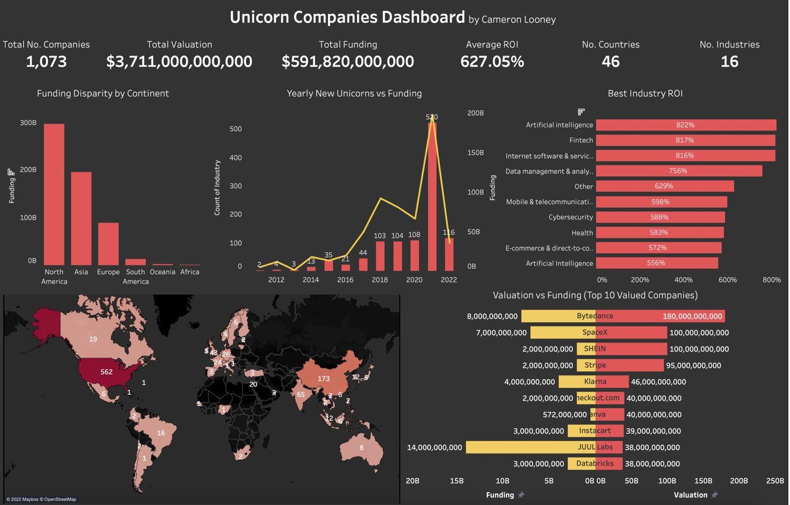

# Unicorn Companies Data Analysis

This was data analytics project exploring and visualising Unicorn Companies. 
A Unicorn is a private company that is worth more than $1B. I implemented a stack involving 
Python, Postgresql and Tableau. 

I used Python to clean and transform my data before I pushed it to a SQL database. I then used the databsse
to produce qeuries to examine the data and generate actionable insights that I could visualise. 

## How to Run the Project
All files are provided to reproduce this project. However the Tableau workbook is available 
here: 

Tableau: [link](https://public.tableau.com/app/profile/cameron.looney/viz/UnicornCompaniesVisualised/Dashboard1)

## Key Callouts
- There is an extreme disparity between continents in regards to funding. This is reflected in the number of Unicorns each continent produced. 
- The number of unicorns seems to lag behind funding. From 2016-2019 funding far exceed the porportion of new unicorns however an extreme spike was then observed in 2021. 
- Unicorns are spread across a wide range of industries and countries. Allowing for safer and more diversified investments which is evident by the 600+% return.

## Contact

LinkedIn - [cameronlooney](https://www.linkedin.com/in/cameronlooney/)

Email - cameronlooney18@gmail.com

(<a href="#top">back to top</a>)
